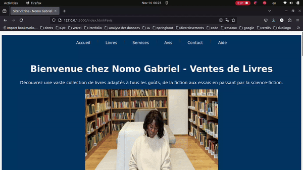

# Nomo Gabriel - Book Sales Showcase Website

This project is a simple HTML and CSS website designed as a practice exercise to develop basic front-end web skills. It features various sections, including a homepage, services offered, client testimonials, a book gallery, a contact form, and a well-structured footer.

[View the live version here](https://nomo-gabriel-library.vercel.app/)

## Project Preview

## Features

- **Navbar**: A navigation bar for easy access to different sections of the site.
- **Hero Section**: A welcome section with a message and a feature image representing the business.
- **About Section**: A brief introduction to the business and its mission in the book sales industry.
- **Services**: A list of services, including personalized book recommendations and fast delivery.
- **Client Testimonials**: Display of client feedback to build credibility and trust.
- **Gallery**: A visual showcase of featured books.
- **Contact Form**: A simple form allowing users to get in touch with the business.
- **Footer**: A footer with contact details and links to social media platforms.

## Technologies Used

- **HTML5**: Semantic page structure.
- **CSS3**: Custom styling with CSS variables for managing colors and fonts.

## License

This project is licensed under the MIT License, allowing for free use, modification, and distribution.

---

**Note**: This is a training project and may be enhanced in the future with additional features and styling.
